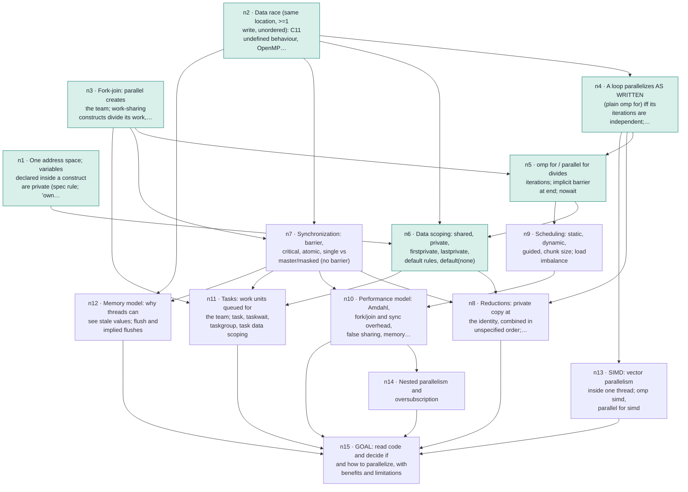

# Learning progress
_Updated 2026-09-25 15:23_

## Active: Parallel programming with OpenMP (`parallel-programming-with-openmp`) · teaching
- Started: 2026-09-24 · Updated: 2026-09-25 15:23
- Note: `/mnt/c/Users/hansh/OneDrive/Master/Learning/2026-09-24 Parallel programming with OpenMP.md`
- Goal: Exam-grade understanding: look at C code and decide whether and how to parallelize it with OpenMP, and explain the benefits and limitations. Scope: core + tasks + extras (SIMD, nested parallelism, memory model/flush). Env: gcc 13.3, 8 hw threads.
- Target capability: Read a C program, decide whether and how to parallelize it with OpenMP (independence, scoping, synchronization, reduction, scheduling, tasks), write the pragmas, and explain the benefits and the limitations (speedup bound, overheads, false sharing, bandwidth, memory model) at exam level.
- Edge findings:
  - concurrency fundamentals: floor = shared address space, race via load/add/store interleave, false sharing = perf not correctness, Amdahl 1/s, default-shared scoping of outer vars; ceiling = none found here (solid)
  - OpenMP construct semantics: floor = parallel runs block once per thread, unordered; ceiling = does not know static vs dynamic schedule, reduction identity init, which constructs have implicit barriers (master), believes tasks spawn a new thread each (thread pool/team model missing)
- **Next:** Teach n7 · Synchronization (prepared; python3 scripts/state.py prep-show n7)

### Plan (approved)
| id | node | depends on | required | coverage | readiness | retention | check | summary |
|---|---|---|---|---|---|---|---|---|
| n1 | One address space; variables declared inside a construct are private (spec rule; 'own stack' is the implementation picture) |  | yes | covered | unknown | unassessed | short | declaration location -> instance count landed on 2nd try; C gap: reads r=q as 'r points to q' (confuses copying a pointer's value with &q); revisit explicitly in n6 (private pointer, shared pointee) |
| n2 | Data race (same location, >=1 write, unordered): C11 undefined behaviour, OpenMP 'unspecified'; race-free is necessary, not sufficient |  | yes | covered | unknown | unassessed | short | after correction: race -> UB independent of optimization level; correctness = race-free source (re-check 4/5) |
| n3 | Fork-join: parallel creates the team; work-sharing constructs divide its work, synchronization constructs order it; none create threads |  | yes | covered | unknown | unassessed | short | fork-join landed: tasks run on existing team (5/5); after demo, parallel replicates vs omp for divides (re-check 5/5) |
| n4 | A loop parallelizes AS WRITTEN (plain omp for) iff its iterations are independent; dependences need reduction, ordering or restructuring | n2 | yes | covered | unknown | unassessed | mcq | derivation 3/5 (rule lacked 'different iterations'); after precise rule, classified 3 loops correctly (a[i]+=1 safe, a[i+1] anti-dep, shared scalar write) 5/5 each |
| n5 | omp for / parallel for divides iterations; implicit barrier at end; nowait | n3, n4 | yes | covered | unknown | unassessed | short | derived implicit barrier between dependent loops (4/5); nowait check 5/5; static same-assignment rule for nowait introduced, revisit in n9 |
| n6 | Data scoping: shared, private, firstprivate, lastprivate, default rules, default(none) | n1, n2, n5 | yes | covered | unknown | unassessed | short | private/firstprivate/lastprivate/default(none) built from n1 inside/outside rule; private=uninit (1st try missed, fixed), firstprivate 5, lastprivate 5 after race-vs-nondeterminism correction, default(none) 3 (forgot scale), private pointer/shared pointee 4 (n1 pointer gap closing). Coding task next. |
| n7 | Synchronization: barrier, critical, atomic, single vs master/masked (no barrier) | n2, n3 | yes | pending | unknown | unassessed |  |  |
| n8 | Reductions: private copy at the identity, combined in unspecified order; deterministic only for associative+commutative ops (FP sums vary) | n4, n6, n7 | yes | pending | unknown | unassessed |  |  |
| n9 | Scheduling: static, dynamic, guided, chunk size; load imbalance | n5 | yes | pending | unknown | unassessed |  |  |
| n10 | Performance model: Amdahl, fork/join and sync overhead, false sharing, memory bandwidth | n7, n9 | yes | pending | unknown | unassessed |  |  |
| n11 | Tasks: work units queued for the team; task, taskwait, taskgroup, task data scoping | n3, n6, n7 | yes | pending | unknown | unassessed |  |  |
| n12 | Memory model: why threads can see stale values; flush and implied flushes | n2, n7 | yes | pending | unknown | unassessed |  |  |
| n13 | SIMD: vector parallelism inside one thread; omp simd, parallel for simd | n4 | yes | pending | unknown | unassessed |  |  |
| n14 | Nested parallelism and oversubscription | n10 | yes | pending | unknown | unassessed |  |  |
| n15 | GOAL: read code and decide if and how to parallelize, with benefits and limitations | n8, n10, n11, n12, n13, n14 | yes | pending | unknown | unassessed |  |  |

### Material corrections
- 2026-09-25 · n2 label and card c69it1: 'correct = race-free' overstated · Race freedom is necessary (a race is UB in C11 §5.1.2.4, 'unspecified' in OpenMP 5.2 §1.4.1) but not sufficient: deadlock and wrong logic remain. Key amended; the learner's attempts stay valid because they matched what was asked.
- 2026-09-25 · n4 label and card cuo6fg: 'parallelizable iff independent' now scoped to 'as written' · Loops with an accumulator or ordered dependence are parallelizable via reduction, ordered or restructuring (n8). Rule key amended, attempts stay valid.
- 2026-09-25 · n3 label: constructs also order work · Synchronization constructs (barrier, critical, atomic) order the team's work rather than dividing it; tasks still run on the existing team.
- 2026-09-25 · n1 label, cards c3eld3/c3kqx8: stack location replaced by the spec's data-sharing rule · OpenMP 5.2 §5.1.1: variables declared in a scope inside the construct are private; 'one per thread's stack' is how gcc implements it, not the rule.
- 2026-09-25 · n8 label: reduction operators, order-independence and floating point separated · OpenMP provides a fixed identifier list (Table 5.1; '-' deprecated) and leaves the combine order unspecified (§5.5.2); deterministic results need an associative and commutative operator; FP addition is not, so last-bit differences are legal.
- 2026-09-25 · card cu1dsb invalidated: 'every thread prints 0' is not guaranteed · The variable mine is private (declared inside the construct, §5.1.1); OpenMP 5.2 §1.4.1 says any other access by one task to the private variables of another task results in unspecified behavior. Both earlier attempts (q=1, q=2) are kept but no longer count against the learner; the card's schedule is reset and a replacement check is flagged. The standing note in LEARNER.md that 'a pointer reaches anything' is corrected.

### Recent log
- 2026-09-25 15:23 · node-edit · n4: label: 'A loop is parallelizable iff its iterations are independent (no loop-carried dependence)' -> 'A loop parallelizes AS WRITTEN (plain omp for) iff its iterations are independent; dependences need reduction, ordering or restructuring' (audit 2026-09-25: distinguish unsynchronized work-sharing from parallelization via reduction/ordered/algorithm change)
- 2026-09-25 15:23 · node-edit · n8: label: 'Reductions: private copy at identity, combine at end; why only associative ops' -> 'Reductions: private copy at the identity, combined in unspecified order; deterministic only for associative+commutative ops (FP sums vary)' (audit 2026-09-25: 'only associative ops' conflated OpenMP's operator list, the order-independence condition and floating-point behaviour)
- 2026-09-25 15:23 · correction · n2: n2 label and card c69it1: 'correct = race-free' overstated
- 2026-09-25 15:23 · correction · n4: n4 label and card cuo6fg: 'parallelizable iff independent' now scoped to 'as written'
- 2026-09-25 15:23 · correction · n3: n3 label: constructs also order work
- 2026-09-25 15:23 · correction · n1: n1 label, cards c3eld3/c3kqx8: stack location replaced by the spec's data-sharing rule
- 2026-09-25 15:23 · correction · n8: n8 label: reduction operators, order-independence and floating point separated
- 2026-09-25 15:23 · correction · n1: card cu1dsb invalidated: 'every thread prints 0' is not guaranteed
- 2026-09-25 15:23 · prep-topic · 6 chunks, 4 exit criteria, 19 sources
- 2026-09-25 15:23 · prep-node · n7: ready, 5 check(s)
- 2026-09-25 15:23 · prep-node · n8: ready, 4 check(s)
- 2026-09-25 15:23 · prep-node · n9: ready, 3 check(s)

