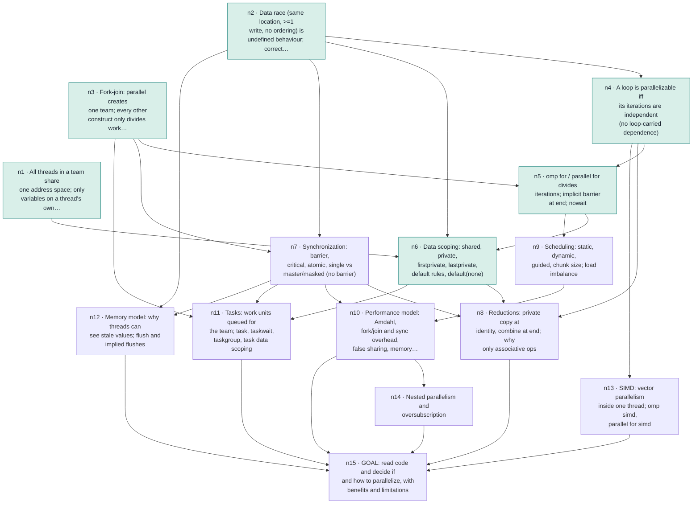

# Learning progress
_Updated 2026-09-25 14:39_

## Active: Parallel programming with OpenMP (`parallel-programming-with-openmp`) · teaching
- Started: 2026-09-24 · Updated: 2026-09-25 14:39
- Note: `/mnt/c/Users/hansh/OneDrive/Master/Learning/2026-09-24 Parallel programming with OpenMP.md`
- Goal: Exam-grade understanding: look at C code and decide whether and how to parallelize it with OpenMP, and explain the benefits and limitations. Scope: core + tasks + extras (SIMD, nested parallelism, memory model/flush). Env: gcc 13.3, 8 hw threads.
- Edge findings:
  - concurrency fundamentals: floor = shared address space, race via load/add/store interleave, false sharing = perf not correctness, Amdahl 1/s, default-shared scoping of outer vars; ceiling = none found here (solid)
  - OpenMP construct semantics: floor = parallel runs block once per thread, unordered; ceiling = does not know static vs dynamic schedule, reduction identity init, which constructs have implicit barriers (master), believes tasks spawn a new thread each (thread pool/team model missing)
- **Next:** start n7 (synchronization: barrier, critical, atomic, single vs master/masked)

### Plan (approved)
| id | node | depends on | status | check | summary |
|---|---|---|---|---|---|
| n1 | All threads in a team share one address space; only variables on a thread's own stack are its own |  | done | short | declaration location -> instance count landed on 2nd try; C gap: reads r=q as 'r points to q' (confuses copying a pointer's value with &q); revisit explicitly in n6 (private pointer, shared pointee) |
| n2 | Data race (same location, >=1 write, no ordering) is undefined behaviour; correct = race-free |  | done | short | after correction: race -> UB independent of optimization level; correctness = race-free source (re-check 4/5) |
| n3 | Fork-join: parallel creates one team; every other construct only divides work among that team |  | done | short | fork-join landed: tasks run on existing team (5/5); after demo, parallel replicates vs omp for divides (re-check 5/5) |
| n4 | A loop is parallelizable iff its iterations are independent (no loop-carried dependence) | n2 | done | mcq | derivation 3/5 (rule lacked 'different iterations'); after precise rule, classified 3 loops correctly (a[i]+=1 safe, a[i+1] anti-dep, shared scalar write) 5/5 each |
| n5 | omp for / parallel for divides iterations; implicit barrier at end; nowait | n3, n4 | done | short | derived implicit barrier between dependent loops (4/5); nowait check 5/5; static same-assignment rule for nowait introduced, revisit in n9 |
| n6 | Data scoping: shared, private, firstprivate, lastprivate, default rules, default(none) | n1, n2, n5 | done | short | private/firstprivate/lastprivate/default(none) built from n1 inside/outside rule; private=uninit (1st try missed, fixed), firstprivate 5, lastprivate 5 after race-vs-nondeterminism correction, default(none) 3 (forgot scale), private pointer/shared pointee 4 (n1 pointer gap closing). Coding task next. |
| n7 | Synchronization: barrier, critical, atomic, single vs master/masked (no barrier) | n2, n3 | pending |  |  |
| n8 | Reductions: private copy at identity, combine at end; why only associative ops | n4, n6, n7 | pending |  |  |
| n9 | Scheduling: static, dynamic, guided, chunk size; load imbalance | n5 | pending |  |  |
| n10 | Performance model: Amdahl, fork/join and sync overhead, false sharing, memory bandwidth | n7, n9 | pending |  |  |
| n11 | Tasks: work units queued for the team; task, taskwait, taskgroup, task data scoping | n3, n6, n7 | pending |  |  |
| n12 | Memory model: why threads can see stale values; flush and implied flushes | n2, n7 | pending |  |  |
| n13 | SIMD: vector parallelism inside one thread; omp simd, parallel for simd | n4 | pending |  |  |
| n14 | Nested parallelism and oversubscription | n10 | pending |  |  |
| n15 | GOAL: read code and decide if and how to parallelize, with benefits and limitations | n8, n10, n11, n12, n13, n14 | pending |  |  |

### Recent log
- 2026-09-25 11:51 · checkpoint · Review 2026-09-25 done (14 cards): weak = one address space (cu1dsb 1->2, thinks other threads can't reach a stack var), pointer value vs pointee (c3eld3 2), tasks = threads (c88nn7 2), nowait overlap treated as a bug without a dependence (cppjk8 2). n6 must open with the shared-pointer/stack card as its hook.
- 2026-09-25 11:55 · checkpoint · n6 started: asked Socratic shared-tmp question (card cdxo04), awaiting answer. Verified facts for n6 (spec 5.2): private copy uninitialised (as if declared without initializer); original's value after a private region is UNSPECIFIED (not 'unchanged'); firstprivate = original's value at entry; lastprivate = sequentially last iteration's value, unspecified if not assigned there; default(none) exempts omp-for loop var, vars declared inside, threadprivate; const vars need a clause since 4.0.
- 2026-09-25 12:09 · checkpoint · n6 in progress: shared-tmp card cdxo04 graded 3 (fix right; blamed iteration order instead of the shared tmp race). Taught private(x) = 'as if declared inside'. Asked cvmhn3 (private(x) with x=5: prints garbage; needs firstprivate) to lead into firstprivate; awaiting answer. Then: firstprivate, lastprivate (the 'last' loop), default rules/default(none), private pointer + shared pointee, coding task.
- 2026-09-25 12:26 · checkpoint · n6 in progress: clarified iteration order vs statement interleaving (learner asked; bug is overlap on shared tmp, threads run chunks simultaneously). cvmhn3 graded 1: believed private(x) copies the original value (5,6,7,8). Taught private = new uninitialised var, firstprivate = initialised from original. Asked c7ycsh (firstprivate count=10 -> 11 and 11); awaiting answer. Then: lastprivate ('last' loop), default rules/default(none), private pointer + shared pointee, coding task.
- 2026-09-25 12:39 · checkpoint · n6 in progress: c7ycsh (firstprivate) 5. Introduced the 'last' loop fixed with private(last); stated spec fact: original's value after private is unspecified. Asked ciga1v (race gone? printf value? copy-out from sequentially last iteration -> lastprivate); awaiting answer. Then: default rules/default(none), private pointer + shared pointee, coding task.
- 2026-09-25 12:53 · checkpoint · n6 in progress: ciga1v graded 2 (thought private(last) still races; said -1 not unspecified; guessed lastprivate name). Taught race vs nondeterminism, lastprivate = sequentially last iteration, in/out clause table. Asked cs7s1b (lastprivate x=i*10 -> always 70); awaiting answer. Then: default rules/default(none), private pointer + shared pointee, coding task.
- 2026-09-25 13:39 · checkpoint · n6 in progress: cs7s1b (lastprivate) 5; explained why the original is unspecified after private (implementation may reuse its storage; gcc prints -1). Taught default rules + default(none) (gcc-verified). c2547a graded 3 (forgot scale, tmp lastprivate instead of private, shared() syntax not taught before). Asked c98zwz (firstprivate pointer -> 1 1 1 1, private pointer shared pointee); awaiting answer. After it: node-done n6, then first coding task (code-task skill).
- 2026-09-25 14:14 · node-done · n6: private/firstprivate/lastprivate/default(none) built from n1 inside/outside rule; private=uninit (1st try missed, fixed), firstprivate 5, lastprivate 5 after race-vs-nondeterminism correction, default(none) 3 (forgot scale), private pointer/shared pointee 4 (n1 pointer gap closing). Coding task next.
- 2026-09-25 14:15 · next · waiting for coding task exercises/parallel-programming-with-openmp/scoping-fix (n6 scoping clauses); after grading, start n7 (synchronization)
- 2026-09-25 14:29 · checkpoint · n6 done; c98zwz 4. Coding task scoping-fix handed out (reference solution verified: shared(a,b,n,scale) private(tmp) lastprivate(last); shared(slots) firstprivate(base)). Learner sent an incomplete message ('I mean'); asked what they meant. Waiting on that and the task.
- 2026-09-25 14:39 · checkpoint · scoping-fix graded 4/5 (PASS; firstprivate used for read-only vars/pointers where shared states intent; pointer-vs-pointee understood). Card cimx09.
- 2026-09-25 14:39 · next · start n7 (synchronization: barrier, critical, atomic, single vs master/masked)

