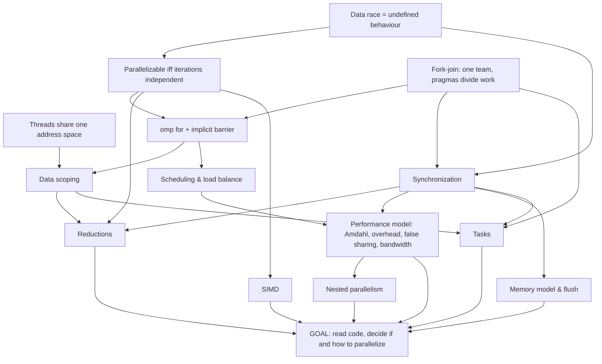

# Learning progress
_Updated 2026-09-24 14:44_

## Active: Parallel programming with OpenMP (`parallel-programming-with-openmp`) · teaching
- Started: 2026-09-24 · Updated: 2026-09-24 14:44
- Note: `/mnt/c/Users/hansh/OneDrive/Master/Learning/2026-09-24 Parallel programming with OpenMP.md`
- Goal: Exam-grade understanding: look at C code and decide whether and how to parallelize it with OpenMP, and explain the benefits and limitations. Scope: core + tasks + extras (SIMD, nested parallelism, memory model/flush). Env: gcc 13.3, 8 hw threads.
- Edge findings:
  - concurrency fundamentals: floor = shared address space, race via load/add/store interleave, false sharing = perf not correctness, Amdahl 1/s, default-shared scoping of outer vars; ceiling = none found here (solid)
  - OpenMP construct semantics: floor = parallel runs block once per thread, unordered; ceiling = does not know static vs dynamic schedule, reduction identity init, which constructs have implicit barriers (master), believes tasks spawn a new thread each (thread pool/team model missing)
- **Next:** Start n6 (data scoping) fresh: motivate from the 'last' loop (n4) and the probe's shared tmp; revisit private pointer / shared pointee explicitly; end with first coding task. Run due reviews first if the learner wants.

### Plan (approved)
| id | node | depends on | status | check | summary |
|---|---|---|---|---|---|
| n1 | All threads in a team share one address space; only variables on a thread's own stack are its own |  | done | short | declaration location -> instance count landed on 2nd try; C gap: reads r=q as 'r points to q' (confuses copying a pointer's value with &q); revisit explicitly in n6 (private pointer, shared pointee) |
| n2 | Data race (same location, >=1 write, no ordering) is undefined behaviour; correct = race-free |  | done | short | after correction: race -> UB independent of optimization level; correctness = race-free source (re-check 4/5) |
| n3 | Fork-join: parallel creates one team; every other construct only divides work among that team |  | done | short | fork-join landed: tasks run on existing team (5/5); after demo, parallel replicates vs omp for divides (re-check 5/5) |
| n4 | A loop is parallelizable iff its iterations are independent (no loop-carried dependence) | n2 | done | mcq | derivation 3/5 (rule lacked 'different iterations'); after precise rule, classified 3 loops correctly (a[i]+=1 safe, a[i+1] anti-dep, shared scalar write) 5/5 each |
| n5 | omp for / parallel for divides iterations; implicit barrier at end; nowait | n3, n4 | done | short | derived implicit barrier between dependent loops (4/5); nowait check 5/5; static same-assignment rule for nowait introduced, revisit in n9 |
| n6 | Data scoping: shared, private, firstprivate, lastprivate, default rules, default(none) | n1, n2, n5 | pending |  |  |
| n7 | Synchronization: barrier, critical, atomic, single vs master/masked (no barrier) | n2, n3 | pending |  |  |
| n8 | Reductions: private copy at identity, combine at end; why only associative ops | n4, n6, n7 | pending |  |  |
| n9 | Scheduling: static, dynamic, guided, chunk size; load imbalance | n5 | pending |  |  |
| n10 | Performance model: Amdahl, fork/join and sync overhead, false sharing, memory bandwidth | n7, n9 | pending |  |  |
| n11 | Tasks: work units queued for the team; task, taskwait, taskgroup, task data scoping | n3, n6, n7 | pending |  |  |
| n12 | Memory model: why threads can see stale values; flush and implied flushes | n2, n7 | pending |  |  |
| n13 | SIMD: vector parallelism inside one thread; omp simd, parallel for simd | n4 | pending |  |  |
| n14 | Nested parallelism and oversubscription | n10 | pending |  |  |
| n15 | GOAL: read code and decide if and how to parallelize, with benefits and limitations | n8, n10, n11, n12, n13, n14 | pending |  |  |

### Recent log
- 2026-09-24 13:00 · checkpoint · n1 not landed yet: learner misses that a declaration inside the region makes one instance per thread; also blurred pointer value vs pointee. Re-teaching with instance-counting check.
- 2026-09-24 13:09 · node-done · n1: declaration location -> instance count landed on 2nd try; C gap: reads r=q as 'r points to q' (confuses copying a pointer's value with &q); revisit explicitly in n6 (private pointer, shared pointee)
- 2026-09-24 13:22 · checkpoint · n2 check graded 2: blames -O2 rather than race->UB. Re-checking with 'is the -O0 build correct?'
- 2026-09-24 13:26 · node-done · n2: after correction: race -> UB independent of optimization level; correctness = race-free source (re-check 4/5)
- 2026-09-24 13:35 · checkpoint · n3: tasks-run-on-team fixed (5/5); but thinks omp for gives each thread the full loop (answered 32). Re-checking X/Y count.
- 2026-09-24 13:38 · node-done · n3: fork-join landed: tasks run on existing team (5/5); after demo, parallel replicates vs omp for divides (re-check 5/5)
- 2026-09-24 14:08 · checkpoint · n4: derivation answered (3/5: verdicts right, rule lacked 'different iterations'); precise rule given. 3-loop MC check (cards c2kn41, ccakmt, c38zyu) not yet answered: learner paused to clarify
- 2026-09-24 14:08 · next · n4: resolve learner's clarification, then ask the 3 loop-classification MCs (a[i]=a[i]+1 safe; a[i]=a[i+1]+1 unsafe; shared 'last' unsafe) one at a time
- 2026-09-24 14:10 · node-done · n4: derivation 3/5 (rule lacked 'different iterations'); after precise rule, classified 3 loops correctly (a[i]+=1 safe, a[i+1] anti-dep, shared scalar write) 5/5 each
- 2026-09-24 14:42 · node-done · n5: derived implicit barrier between dependent loops (4/5); nowait check 5/5; static same-assignment rule for nowait introduced, revisit in n9
- 2026-09-24 14:44 · checkpoint · Session 1 ended 2026-09-24 14:45 at learner's request. Done n1-n5. Weak spots: C pointer value vs pointee (r=q read as 'points to q'); first instinct that omp for replicates the loop (fixed). Prefers one MC question per call.
- 2026-09-24 14:44 · next · Start n6 (data scoping) fresh: motivate from the 'last' loop (n4) and the probe's shared tmp; revisit private pointer / shared pointee explicitly; end with first coding task. Run due reviews first if the learner wants.

